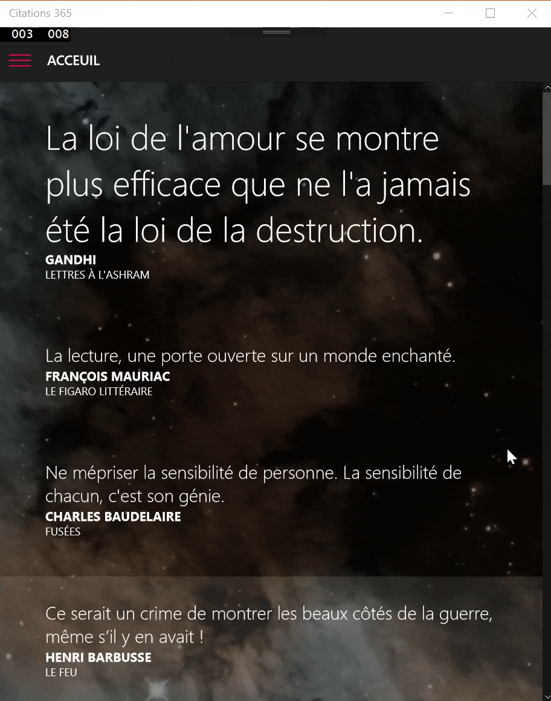

# wincomposition samples

These samples demonstrate some of the [Windows.UI.Composition](https://msdn.microsoft.com/en-us/windows/uwp/graphics/composition-animation) features
in a simple way. Thus you can combine several features as you want.

## prerequisites
You need at least the Windows 10 Anniversary SDK to build the solution
and the Anniversary update on targeted devices.

## previews

* Blur (when scrolling)

* Parallax

